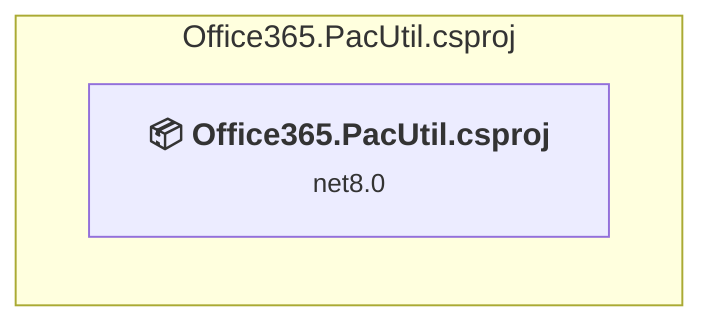

# Projects and dependencies analysis

This document provides a comprehensive overview of the projects and their dependencies in the context of upgrading to .NETCoreApp,Version=v10.0.

## Table of Contents

- [Executive Summary](#executive-Summary)
  - [Highlevel Metrics](#highlevel-metrics)
  - [Projects Compatibility](#projects-compatibility)
  - [Package Compatibility](#package-compatibility)
  - [API Compatibility](#api-compatibility)
- [Aggregate NuGet packages details](#aggregate-nuget-packages-details)
- [Top API Migration Challenges](#top-api-migration-challenges)
  - [Technologies and Features](#technologies-and-features)
  - [Most Frequent API Issues](#most-frequent-api-issues)
- [Projects Relationship Graph](#projects-relationship-graph)
- [Project Details](#project-details)

  - [Office365.PacUtil.csproj](#office365pacutilcsproj)

## Executive Summary

### Highlevel Metrics

| Metric | Count | Status |
| :--- | :---: | :--- |
| Total Projects | 1 | All require upgrade |
| Total NuGet Packages | 7 | 5 need upgrade |
| Total Code Files | 10 |  |
| Total Code Files with Incidents | 3 |  |
| Total Lines of Code | 1093 |  |
| Total Number of Issues | 72 |  |
| Estimated LOC to modify | 66+ | at least 6.0% of codebase |

### Projects Compatibility

| Project | Target Framework | Difficulty | Package Issues | API Issues | Est. LOC Impact | Description |
| :--- | :---: | :---: | :---: | :---: | :---: | :--- |
| [Office365.PacUtil.csproj](#office365pacutilcsproj) | net8.0 | 🟢 Low | 5 | 66 | 66+ | DotNetCoreApp, Sdk Style = True |

### Package Compatibility

| Status | Count | Percentage |
| :--- | :---: | :---: |
| ✅ Compatible | 2 | 28.6% |
| ⚠️ Incompatible | 0 | 0.0% |
| 🔄 Upgrade Recommended | 5 | 71.4% |
| ***Total NuGet Packages*** | ***7*** | ***100%*** |

### API Compatibility

| Category | Count | Impact |
| :--- | :---: | :--- |
| 🔴 Binary Incompatible | 0 | High - Require code changes |
| 🟡 Source Incompatible | 62 | Medium - Needs re-compilation and potential conflicting API error fixing |
| 🔵 Behavioral change | 4 | Low - Behavioral changes that may require testing at runtime |
| ✅ Compatible | 962 |  |
| ***Total APIs Analyzed*** | ***1028*** |  |

## Aggregate NuGet packages details

| Package | Current Version | Suggested Version | Projects | Description |
| :--- | :---: | :---: | :--- | :--- |
| Microsoft.Extensions.Configuration | 8.0.0 | 10.0.5 | [Office365.PacUtil.csproj](#office365pacutilcsproj) | NuGet package upgrade is recommended |
| Microsoft.Extensions.Configuration.Json | 8.0.0 | 10.0.5 | [Office365.PacUtil.csproj](#office365pacutilcsproj) | NuGet package upgrade is recommended |
| Microsoft.Extensions.Hosting | 8.0.0 | 10.0.5 | [Office365.PacUtil.csproj](#office365pacutilcsproj) | NuGet package upgrade is recommended |
| Newtonsoft.Json | 13.0.3 | 13.0.4 | [Office365.PacUtil.csproj](#office365pacutilcsproj) | NuGet package upgrade is recommended |
| System.CommandLine | 2.0.0-beta4.22272.1 |  | [Office365.PacUtil.csproj](#office365pacutilcsproj) | ✅Compatible |
| System.CommandLine.Hosting | 0.4.0-alpha.22272.1 |  | [Office365.PacUtil.csproj](#office365pacutilcsproj) | ✅Compatible |
| System.Configuration.ConfigurationManager | 8.0.0 | 10.0.5 | [Office365.PacUtil.csproj](#office365pacutilcsproj) | NuGet package upgrade is recommended |

## Top API Migration Challenges

### Technologies and Features

| Technology | Issues | Percentage | Migration Path |
| :--- | :---: | :---: | :--- |
| Legacy Configuration System | 18 | 27.3% | Legacy XML-based configuration system (app.config/web.config) that has been replaced by a more flexible configuration model in .NET Core. The old system was rigid and XML-based. Migrate to Microsoft.Extensions.Configuration with JSON/environment variables; use System.Configuration.ConfigurationManager NuGet package as interim bridge if needed. |

### Most Frequent API Issues

| API | Count | Percentage | Category |
| :--- | :---: | :---: | :--- |
| T:System.Configuration.ConfigurationErrorsException | 9 | 13.6% | Source Incompatible |
| M:System.Configuration.ConfigurationErrorsException.#ctor(System.String) | 9 | 13.6% | Source Incompatible |
| T:System.CommandLine.Builder.CommandLineBuilder | 6 | 9.1% | Source Incompatible |
| T:System.Net.Http.HttpContent | 4 | 6.1% | Behavioral Change |
| T:System.CommandLine.Invocation.ICommandHandler | 4 | 6.1% | Source Incompatible |
| P:System.CommandLine.Option.IsRequired | 4 | 6.1% | Source Incompatible |
| M:System.CommandLine.Command.Add(System.CommandLine.Option) | 4 | 6.1% | Source Incompatible |
| M:System.CommandLine.Command.AddCommand(System.CommandLine.Command) | 3 | 4.5% | Source Incompatible |
| T:System.CommandLine.Command | 3 | 4.5% | Source Incompatible |
| M:System.CommandLine.Command.#ctor(System.String,System.String) | 3 | 4.5% | Source Incompatible |
| T:System.CommandLine.NamingConventionBinder.CommandHandler | 2 | 3.0% | Source Incompatible |
| P:System.CommandLine.Command.Handler | 2 | 3.0% | Source Incompatible |
| T:System.CommandLine.Builder.CommandLineBuilderExtensions | 2 | 3.0% | Source Incompatible |
| M:System.CommandLine.Builder.CommandLineBuilder.#ctor(System.CommandLine.Command) | 1 | 1.5% | Source Incompatible |
| T:System.CommandLine.RootCommand | 1 | 1.5% | Source Incompatible |
| M:System.CommandLine.RootCommand.#ctor(System.String) | 1 | 1.5% | Source Incompatible |
| T:System.CommandLine.Hosting.HostingExtensions | 1 | 1.5% | Source Incompatible |
| M:System.CommandLine.Hosting.HostingExtensions.UseHost(System.CommandLine.Builder.CommandLineBuilder,System.Func{System.String[],Microsoft.Extensions.Hosting.IHostBuilder},System.Action{Microsoft.Extensions.Hosting.IHostBuilder}) | 1 | 1.5% | Source Incompatible |
| M:System.CommandLine.Builder.CommandLineBuilderExtensions.UseDefaults(System.CommandLine.Builder.CommandLineBuilder) | 1 | 1.5% | Source Incompatible |
| M:System.CommandLine.Builder.CommandLineBuilderExtensions.CancelOnProcessTermination(System.CommandLine.Builder.CommandLineBuilder) | 1 | 1.5% | Source Incompatible |
| T:System.CommandLine.Parsing.Parser | 1 | 1.5% | Source Incompatible |
| M:System.CommandLine.Builder.CommandLineBuilder.Build | 1 | 1.5% | Source Incompatible |
| T:System.CommandLine.Parsing.ParserExtensions | 1 | 1.5% | Source Incompatible |
| M:System.CommandLine.Parsing.ParserExtensions.InvokeAsync(System.CommandLine.Parsing.Parser,System.String[],System.CommandLine.IConsole) | 1 | 1.5% | Source Incompatible |

## Projects Relationship Graph

Legend:
📦 SDK-style project
⚙️ Classic project

## Project Details

### Office365.PacUtil.csproj

#### Project Info

- **Current Target Framework:** net8.0
- **Proposed Target Framework:** net10.0
- **SDK-style**: True
- **Project Kind:** DotNetCoreApp
- **Dependencies**: 0
- **Dependants**: 0
- **Number of Files**: 10
- **Number of Files with Incidents**: 3
- **Lines of Code**: 1093
- **Estimated LOC to modify**: 66+ (at least 6.0% of the project)

#### Dependency Graph

Legend:
📦 SDK-style project
⚙️ Classic project

### API Compatibility

| Category | Count | Impact |
| :--- | :---: | :--- |
| 🔴 Binary Incompatible | 0 | High - Require code changes |
| 🟡 Source Incompatible | 62 | Medium - Needs re-compilation and potential conflicting API error fixing |
| 🔵 Behavioral change | 4 | Low - Behavioral changes that may require testing at runtime |
| ✅ Compatible | 962 |  |
| ***Total APIs Analyzed*** | ***1028*** |  |

#### Project Technologies and Features

| Technology | Issues | Percentage | Migration Path |
| :--- | :---: | :---: | :--- |
| Legacy Configuration System | 18 | 27.3% | Legacy XML-based configuration system (app.config/web.config) that has been replaced by a more flexible configuration model in .NET Core. The old system was rigid and XML-based. Migrate to Microsoft.Extensions.Configuration with JSON/environment variables; use System.Configuration.ConfigurationManager NuGet package as interim bridge if needed. |

